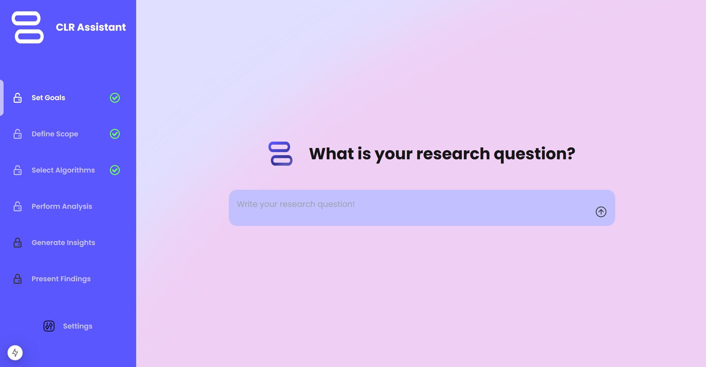
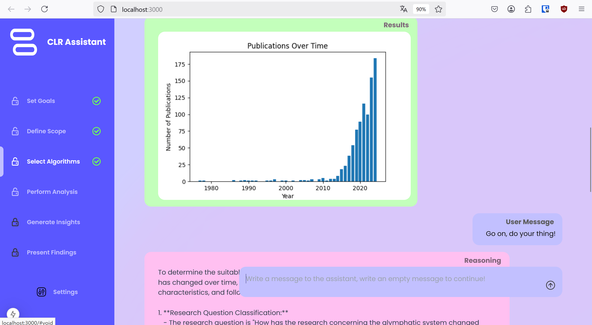

# CLR-LLM-AGENT
### Landing Page

### Assistant in Use


## Installation 

The *CLR-LLM-AGENT* is a web-based LLM-agent. The first thing you need to do is 
install **Python** on your system.
* tested **Python** version = `3.12.6`

For the frontend you need to install **Node.js**
* tested **Node.js** version = `v20.17.0`

Now install the python requirements, preferably into a venv. 
```bash
pip install -r requirement.txt
```
For the frontend you need to change into the `gui` folder via. 
```bash
cd ./gui
```
Then run 
```bash 
npm install
```
to install all node required packages.

You will also need a `.env` file in which you provide your *OpenAI* API key and your e-mail address.
Create the `.env` file in the root directory of this project and write this in the file: 
```js
OPENAI_API_KEY=<your_openai_key>
EMAIL_ADDRESS=<your_email_address>
```

## Getting Started

After the installation you can start the application by starting the backend via:
```bash
python api.py
```
To start the frontend you need to change to the `./gui` folder
```bash 
cd ./gui
```
and run 
```bash
npm run dev
```

You will now find the CLR-Assistant at `localhost:3000`

## Project Structure
#### folder structure
```
├── agents/
├── algorithms/
├── gui/
|   ├── app /
|   |   ├── components/
|   |   ├── public/
|   |   ├── layout.tsx
|   |   └── page.tsx
|   ├── package.json
|   ├── tailwind.config.ts
├── step1 /
├── step2 /
├── step3 /
├── step4 /
├── step5 /
├── step6 /
├── temp / 
├── tools / 
├── visualizations
├── api.py
```

***agents***
This folder contains parent classes for different types of LLM-Agents that can be used in this project
e.g. `ReasoningBaseClassifier.py`, `ReasoningTextGenerator.py`

All these classes are basically prompt templates that promt a selected OpenAI model 
to behave in a certain way. These base-classes can be inherited when a concrete LLM agent should 
be build. For example the `ReasoningBaseClassifer` is inherited in `./step1/ReasoningResearchQuestionClassifier.py` Where it is used to create a LLM agent that can classify 
the research question into a set of 4 categories while providing reasoning for its answere. 

***algorithms***
The algoritms folder contains all NLP algorithms the model could use for the CLR. 
All algorithms follow a certain pattern: 
* All potential hyperparameters are passed to the algorithm during intitialization. 
* They have a predefined `__call__` method, which only takes a list of documents as input (`List[Dict[str, Any]]`), which in *most* cases must contain a  "AbstractNormalized" key. The `__call__` method returns `Dict[str, Any]` with varius results in text form. visualizations and other result files are provided as a "path/to/the/file" string. 
    * The data provided by the *Pubmed-Loader* already has this `List[Dict[str, Any]]` format, to add the "AbstractNormalized" entry to the dict the TextNormalizer form `/tools` should be used. 

***gui***
Contains the React Typescript Next-JS Gui for the CLR assistant

***step1***
* `ReasoningResearchQuestionClassifier.py`: An implementation of the ReasoningBaseClassifier, which is prompted to classify the research question. 

***step2***

* `prompts.py`: A long prompt designed to prompt an LLM to generate search Pubmed strings for a research question and a research-questiong classification. 
* `ReasoningSearchQueryGenerator.py`: An implementation of the `ReasoningTextGenerator.py` uses the prompt from `prompts.py` to generate Pubmed search strings. 

***step3***
* `prompts`: A set of varius prompts used to promt an LLM to select fitting NLP algorithms from the supported algorithms for a given research-question, dataset and research-question qualification. The prompt currently in use is `algorithms_selector_prompt_v2`. 
**Important:** If you add new algorithms to the `algorithms` folder you have to list and describe them in this prompt, otherwise the LLM will not be able to select them.  
* `AlgorithmsSelector.py`: Implements `ReasoningTextGenerator.py` and usese the algorithms_selector_prompt_v2 to select fitting algorithms for the CLR.

***step4***
* `prompts.py`: Contains the dict `hyperparamter_selection_prompts` which has an entry for each algorithm from the `./algorithms` folder, which helps an LLM to guess the hyperparameters needed to successfully use an algorithm. The prompt describes each hyperparameter and its influence on the output. 
**Important:** If you add new algorithms to the `algorithms` folder you have to add an entry for this algorithm in the `hyperparamter_selection_prompts` dict!
* `HyperpParameterGuessor.py`: Implements `ReasoningTextGenerator` and uses the matching entry from the `hyperparamter_selection_prompts` dict to guess matching hyperparameters for an algorithm. 
* `ResultsParser.py`: Currently a dummy implementation, but this class could be adapted to parse the algorithm output to get a more human interpretable form. 

***step5***
* `prompts.py`: A relatively simple prompt that prompts an LLM to analyze the results of the algorithms.
    **Potential Improvements**: Don't analyze all results of all algorihtms at once, analyze the results of each algorithm separately, and combine them later in another LLM call
* `ResultsAnalyzer.py`:  Implements `TextGenerator.py` and uses the prompt form `prompts.py` to analze the results of the analysis.

**step6**
* `prompts.py`: A relatively simple prompt that prompts an LLM to convert the analyzed results to Latex code. 
    **Potential Improvements**: Don't analyze all results of all algorihtms at once, analyze the results of each algorithm separately, and combine them later in another LLM call
* `ResultsAnalyzer.py`:  Implements `TextGenerator.py` and uses the prompt form `prompts.py` to convert the analyzed results to Latex code. 

***tools***
* `BasicDatasetAnalyzer.py`: Analyzes the publications overtime of the  dataset and performs a simple LLM call to generate a textual analysis of the publications overtime
* `data_sources.py`: A dictionary of all possible datasources and their api endpoint where they are available. Currently only pubmed is supported. 
The code for the **Pubmed-Downloader** is saved in a separate repository, you can find it here: 
https://github.com/LukasBeckers/glymphe-clr-data-sources 
You can host it locally via 
    ```bash
    docker compose up -d 
    ```
    **Important** If you want to add new data-sources, make sure that the api endpoint behaves similarly to the Pubmed-Downloader and adapt the prompt from `step2` to feature the new datasource!
* `DataLoader.py`: A simple class to download the data from the selected data-source currently only Pubmed, but if another downloader is implemented and also features an endpoint that takes the search-string as a string and the user-email as a second input and returns the results as python-dicts, it will also work for them. 
* `Textnormalizer.py`: Class used to normalize the abstract texts.

***api.py***
`api.py` combines the api endpoints aswell as the business-logic of how to perform the analysis steps of the CLR. It takes the longest go get your head around this python file. If you want to do a rework of the project start here. 


# Theoretical Background

The concept of this project is based on the the paper 
*Computational Literature Reviews: Method, Algorithms, and Roadmap*
by David Antons, Christoph F. Breidbach and Torsten Oliver Salge
https://doi.org/10.1177/1094428121991230
In this paper 6 essential steps of a Computational Literature Review (CLR) are described. 
This project aims at Providing an AI assistant for all 6 steps of a CLR enabling 
researchers without technical knowledge to perform a CLR.

## The 6 Steps of a CLR
| **Step** | **Step Title**                  | **Description**                                                                                                                                                                                                                                                                                                                                                                                                                                                                                                               |
|----------|---------------------------------|-------------------------------------------------------------------------------------------------------------------------------------------------------------------------------------------------------------------------------------------------------------------------------------------------------------------------------------------------------------------------------------------------------------------------------------------------------------------------------------------------------------------------------|
| **1**    | **Begin with a Conceptual Goal** | - **Identify CLR Objectives:** Determine the primary aim of the review (e.g., explicating, envisioning, relating, debating).<br>- **Align Goals with Research Needs:** Ensure the goals advance understanding beyond descriptive summaries.<br>- **Balance Feasibility and Utility:** Consider technical feasibility and the usefulness of the outcomes.<br>- **Iterative Goal Setting:** Be prepared to refine goals based on initial findings and insights.                           |
| **2**    | **Operationalize the CLR**        | - **Define the Knowledge Domain:** Specify the scope, including keywords, research fields, timeframes, and journal sources.<br>- **Compile the Text Corpus:** Collect relevant articles from comprehensive databases like Web of Science or Scopus.<br>- **Apply Scoping Rules:** Develop and iterate search strings to balance breadth and specificity.<br>- **Manual Screening:** Ensure the corpus excludes unsuitable texts (e.g., retracted articles, predatory journals).<br>- **Extract Meta-Data:** Gather titles, authors, journals, and citation counts for reproducibility. |
| **3**    | **Choose a Computational Technique** | - **Match Techniques to Goals:** Select algorithms that align with the CLR’s conceptual objectives (e.g., ATC for explicating, LDA for envisioning).<br>- **Assess Accessibility:** Choose methods compatible with the research team's technical skills and available resources.<br>- **Select Algorithm Types:** Consider supervised, unsupervised, or dictionary-based techniques based on review goals.<br>- **Understand Trade-Offs:** Balance control and customizability versus ease of use, especially for novice users.                                |
| **4**    | **Perform the Content Analysis**   | - **Data Preprocessing:** Convert texts to machine-readable formats, normalize text (e.g., lowercasing, removing stopwords), and handle compound words using n-grams.<br>- **Calibrate Algorithms:** Set appropriate parameters for chosen algorithms (e.g., number of topics in LDA).<br>- **Execute Analysis:** Run the computational techniques to generate outputs like topic distributions or semantic networks.<br>- **Validate Outputs:** Check for accuracy and plausibility, often requiring manual review by domain experts.<br>- **Enhance Outputs:** Use visualization and additional analyses to deepen insights. |
| **5**    | **Generate Original Insights**     | - **Interpret Results:** Apply domain knowledge to make sense of algorithmic outputs.<br>- **Align with Goals:** Ensure insights support the initial conceptual objectives.<br>- **Iterative Refinement:** Continuously refine analyses and revisit earlier steps as needed to uncover meaningful patterns.<br>- **Identify Knowledge Gaps:** Highlight areas for future research or theoretical development.<br>- **Collaborate Across Teams:** Work with interdisciplinary teams to enhance interpretation and validity.                                           |
| **6**    | **Present the Findings**           | - **Choose a Synthesis Form:** Select how to present results (e.g., research agenda, taxonomy, alternative models, meta-theory).<br>- **Communicate Clearly:** Use visualizations and structured narratives to make findings accessible.<br>- **Link to Objectives:** Clearly state how the findings address the CLR’s conceptual goals.<br>- **Leverage for Theory Building:** Integrate CLR insights with existing theories or develop new theoretical frameworks.<br>- **Document Methodology:** Provide a transparent account of the CLR process for replicability.           |


# Step 1

### Begin with a conceptual goal.


In this work everything will begin with a research question.

This research question will be classified into Explicating, Envisioning, Relating, Debating


# Step 2

A LLM Agent will generate search_strings based on the research question and 
the classification result. 

The dataset will be downloaded automatically, duplicates will be dropped and 
another LLM Agent will analyze the text corpus and 


# Step 3

Unsupervised Techniques

    Latent Dirichlet Allocation (LDA)
    Latent Semantic Indexing/Analysis (LSI/LSA)
    Probabilistic Latent Semantic Analysis (PLSA)
    Non-negative Matrix Factorization (NMF)
    Correlated Topic Models
    Hierarchical Dirichlet Processes (HDP)
    Computer-Assisted Clustering (CAC)

Dictionary-Based Techniques

    Linguistic Inquiry and Word Count (LIWC)
    Coh-Metrix


Latent Dirichlet Allocation (LDA)
Latent Semantic Indexing/Analysis (LSI/LSA)
Probabilistic Latent Semantic Analysis (PLSA)
Non-negative Matrix Factorization (NMF)
Hierarchical Dirichlet Processes (HDP)
Correlated Topic Models
Computer-Assisted Clustering (CAC)
Leximancer
Linguistic Inquiry and Word Count (LIWC)
Coh-Metrix
N-grams
Network Analysis
Regression Analysis
Heatmaps
Automated Frame Analysis (AFA)
Automated Narrative Analysis (ANA)

# Known Bugs
* Currently there is a bug in which the tokens of the model sometimes appear in
the wrong ordering completely scrambeling the answere and the reasoning prompt template. 
I suspect this to be a concurrency issue and not a model issue. This error only appears sometimes during 
inference which makes debugging dificult. 
* Currently the Latex compiler does not work anymore, I have not looked into it yet. It worked in the past but even reverting to the old commit does not help. 